# Video Analytics Platform — Detailed Component Architecture

> Complete Screen Specifications | Backend Pipeline | Auto-Scaling Flows

---

## Table of Contents

1. [Frontend — Screen Architecture](#1-frontend--screen-architecture)
2. [Backend — Layer 0: Ingestion](#2-backend--layer-0-ingestion)
3. [Backend — Layer 1: Control Plane](#3-backend--layer-1-control-plane)
4. [Backend — Layer 2: Data Plane](#4-backend--layer-2-data-plane-deepstream-pipeline)
5. [Backend — Layer 3: Output](#5-backend--layer-3-output)
6. [Auto-Scaling Flow (100 → 200 cameras)](#6-auto-scaling-flow)
7. [Watchdog Reconciliation Loop](#7-watchdog-reconciliation-loop)
8. [End-to-End Data Flow](#8-end-to-end-data-flow)
9. [Screen-to-Table Reference](#9-screen-to-table-reference)

---

## 1. Frontend — Screen Architecture

### Full Screen Flow — Connected Block Diagram

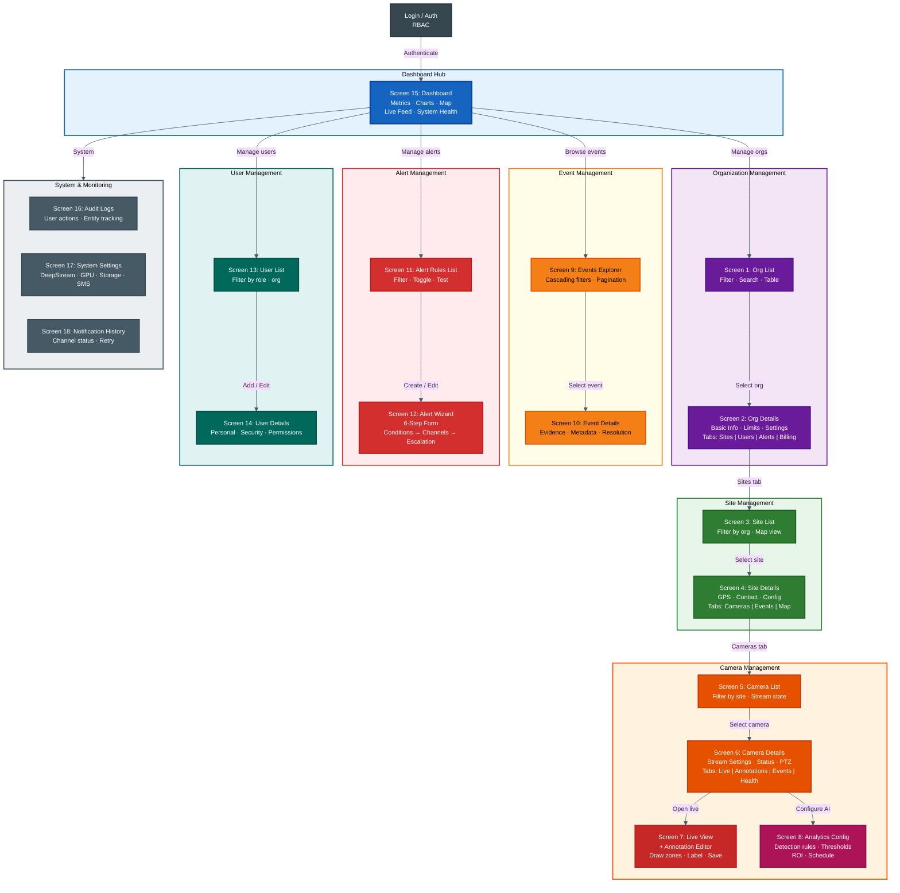

---

### Screen 1 — Organization List (Detail)

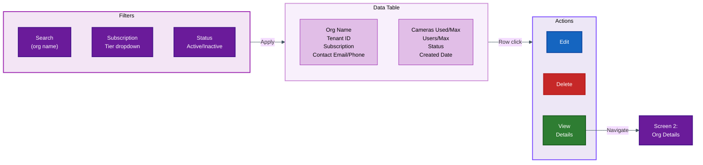

| Column | Source | Notes |
|--------|--------|-------|
| Organization Name | `organizations.name` | Searchable |
| Tenant ID | `organizations.tenant_id` | Unique |
| Subscription | `organizations.subscription_tier` | Filterable |
| Contact Email | `organizations.contact_email` | — |
| Contact Phone | `organizations.contact_phone` | — |
| Cameras Used / Max | `COUNT(cameras.id)` / `organizations.max_cameras` | Aggregated |
| Users / Max | `COUNT(users.id)` / `organizations.max_users` | Aggregated |
| Status | `organizations.is_active` | Badge |
| Created Date | `organizations.created_at` | Formatted |

---

### Screen 2 — Organization Details (Detail)

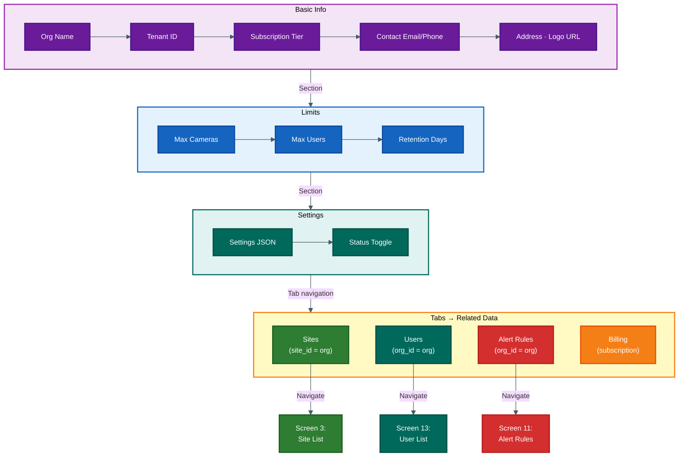

---

### Screens 3-4 — Site List & Details

| Column (Screen 3) | Source | Notes |
|--------|--------|-------|
| Site Name | `sites.name` | Searchable |
| Organization | `organizations.name` | FK dropdown |
| Location (Lat/Long) | `sites.location` | PostGIS |
| Address | `sites.address` | — |
| Timezone | `sites.timezone` | — |
| Contact Person/Phone | `sites.contact_person` / `contact_phone` | — |
| Cameras Count | `COUNT(cameras.id)` | Aggregated |
| Status | `sites.is_active` | Badge |
| Created Date | `sites.created_at` | — |

**Screen 3 Actions:** Edit · Delete · View Cameras · View on Map

**Screen 4 Sections:** Basic Info (name, org, GPS, address, timezone) → Contact (person, phone, email) → Config (settings JSON, status) → **Tabs:** Cameras | Events | Map View

---

### Screens 5-6 — Camera List & Details

```mermaid
%%{init: {'theme': 'base', 'themeVariables': { 'fontSize': '13px', 'lineColor': '#455A64' }}}%%
flowchart LR
    subgraph S5["Screen 5 — Camera List"]
        F["Filters\nSite · Type · Stream State\nSearch Name/ID"]:::filter
        F -->|"Apply"| T["Table (11 cols)\nName · ID · Site · RTSP\nType · Res · FPS\nStream State · Pod\nHeartbeat · Status"]:::table
        T -->|"Row action"| A["Actions\nView Live · Edit\nDelete · Annotations\nHealth Check"]:::action
    end

    A -->|"Select camera"| S6

    subgraph S6["Screen 6 — Camera Details"]
        B["Basic Info\nName · ID · Site · RTSP"]:::orange
        B --> SS["Stream Settings\nType · Res · FPS\nBitrate · Codec"]:::blue
        SS --> ST["Status\nStream State · Pod\nHeartbeat · Active"]:::green
        ST --> AN["Analytics Config\nJSON"]:::purple
        AN --> PTZ["PTZ Config\n(conditional)"]:::red
        PTZ --> TABS["Tabs\nLive View | Annotations\nEvents | Health Metrics"]:::amber
    end

    TABS -->|"Live View"| S7["Screen 7:\nLive + Annotations"]:::live
    TABS -->|"Configure"| S8["Screen 8:\nAnalytics Config"]:::analytics

    classDef filter fill:#E65100,stroke:#BF360C,color:#fff,stroke-width:2px
    classDef table fill:#FFE0B2,stroke:#FF9800,color:#000,stroke-width:1px
    classDef action fill:#E65100,stroke:#BF360C,color:#fff,stroke-width:2px
    classDef orange fill:#E65100,stroke:#BF360C,color:#fff,stroke-width:2px
    classDef blue fill:#1565C0,stroke:#0D47A1,color:#fff,stroke-width:2px
    classDef green fill:#2E7D32,stroke:#1B5E20,color:#fff,stroke-width:2px
    classDef purple fill:#6A1B9A,stroke:#4A148C,color:#fff,stroke-width:2px
    classDef red fill:#C62828,stroke:#B71C1C,color:#fff,stroke-width:2px
    classDef amber fill:#F57F17,stroke:#E65100,color:#000,stroke-width:2px
    classDef live fill:#C62828,stroke:#B71C1C,color:#fff,stroke-width:2px
    classDef analytics fill:#AD1457,stroke:#880E4F,color:#fff,stroke-width:2px

    style S5 fill:#FFF3E0,stroke:#E65100,color:#000,stroke-width:2px
    style S6 fill:#FFF8E1,stroke:#FF9800,color:#000,stroke-width:2px
```

---

### Screen 7 — Live View + Annotation Editor

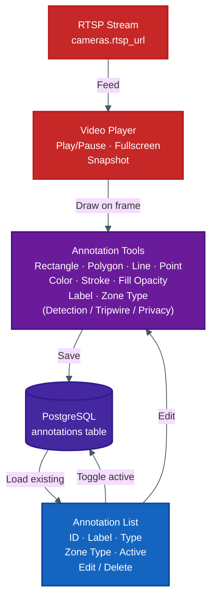

---

### Screen 8 — Analytics Configuration

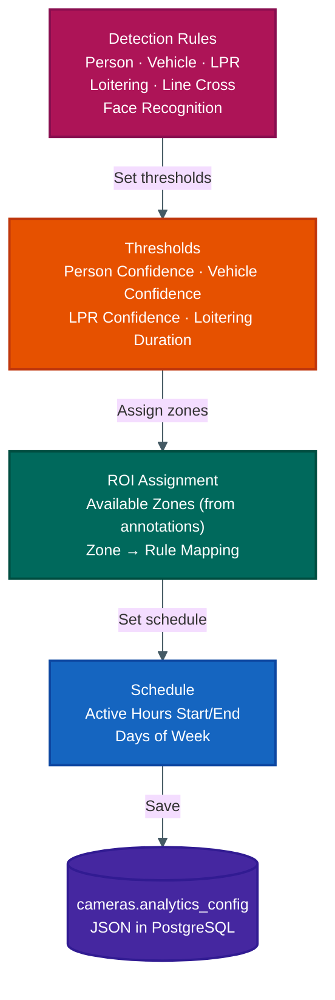

---

### Screen 9-10 — Events Explorer & Details

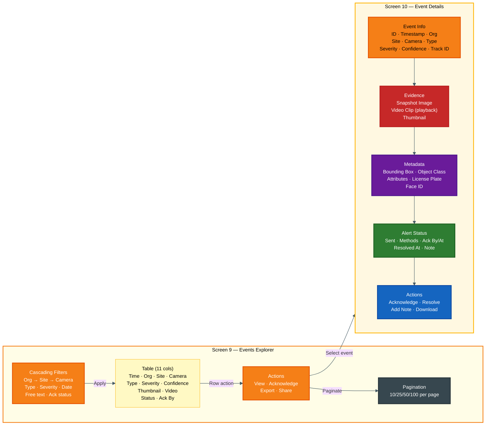

---

### Screen 12 — Alert Rule Wizard (6-Step Flow)

```mermaid
%%{init: {'theme': 'base', 'themeVariables': { 'fontSize': '13px', 'lineColor': '#455A64' }}}%%
flowchart LR
    S1["Step 1\nBasic Info\nName · Desc\nOrg · Site · Camera"]:::step1

    S1 -->|"Next"| S2["Step 2\nEvent Conditions\nTypes (multi)\nSeverity threshold\nConfidence (slider)\nCooldown (sec)"]:::step2

    S2 -->|"Next"| S3["Step 3\nTime Schedule\nStart/End time\nDays of week"]:::step3

    S3 -->|"Next"| S4["Step 4\nChannels\nSMS · WhatsApp\nVoice · Email\nWebhook"]:::step4

    S4 -->|"Next"| S5["Step 5\nChannel Config\nWhatsApp template\nSMS template\nCall message\nWebhook URL/headers"]:::step5

    S5 -->|"Next"| S6["Step 6\nEscalation\nEnable toggle\nDelay (sec)\nEscalation rule"]:::step6

    S6 -->|"Save"| DB[("alert_rules\nPostgreSQL")]:::infra

    classDef step1 fill:#D32F2F,stroke:#B71C1C,color:#fff,stroke-width:2px
    classDef step2 fill:#E65100,stroke:#BF360C,color:#fff,stroke-width:2px
    classDef step3 fill:#F57F17,stroke:#E65100,color:#000,stroke-width:2px
    classDef step4 fill:#2E7D32,stroke:#1B5E20,color:#fff,stroke-width:2px
    classDef step5 fill:#1565C0,stroke:#0D47A1,color:#fff,stroke-width:2px
    classDef step6 fill:#6A1B9A,stroke:#4A148C,color:#fff,stroke-width:2px
    classDef infra fill:#4527A0,stroke:#311B92,color:#fff,stroke-width:2px
```

---

### Screen 13-14 — User Management

| Column (Screen 13) | Source |
|--------|--------|
| Name | `users.first_name` + `users.last_name` |
| Email | `users.email` |
| Organization | `organizations.name` |
| Role | `users.role` |
| Phone | `users.phone` |
| MFA Enabled | `users.mfa_enabled` |
| Last Login | `users.last_login` |
| Status | `users.is_active` |

**Screen 13 Actions:** Edit · Delete · Reset Password · Impersonate (admin)

**Screen 14 Sections:** Personal Info (name, email, phone, org) → Security (role, permissions JSON, MFA toggle, password) → Status (active toggle)

---

### Screen 15 — Dashboard (Widget Flow)

```mermaid
%%{init: {'theme': 'base', 'themeVariables': { 'fontSize': '13px', 'lineColor': '#455A64' }}}%%
flowchart TD
    subgraph METRICS["Metrics Cards Row"]
        direction LR
        M1["Total\nCameras"]:::blue
        M2["Active\nStreams"]:::green
        M3["Events\nToday"]:::amber
        M4["Critical\nAlerts"]:::red
        M5["GPU\nUtilization"]:::purple
        M6["Storage\nUsed"]:::teal
    end

    METRICS -->|"Summary data"| ORG_SUM["Org Summary Table\nOrg Name · Camera Count\nEvents 24hr · Critical Alerts"]:::blueLight

    ORG_SUM -->|"Real-time"| FEED["Live Events Feed\nTime · Camera · Type\nSeverity · Thumbnail"]:::redLight

    FEED -->|"Hourly data"| CHART["Event Trend Chart\nPerson · Vehicle · Line Cross\nSource: event_summary_hourly"]:::amberLight

    CHART -->|"Ranked"| TOP["Top Cameras (24hr)\nCamera Name · Site\nEvent Count"]:::orangeLight

    TOP -->|"Infra data"| HEALTH["System Health\nPod Name · Status\nStreams/Max · Heartbeat"]:::greenLight

    HEALTH -->|"Geo data"| MAP["Map View\nSite pins · Alert indicators\nRed (critical) · Yellow (warning)"]:::tealLight

    classDef blue fill:#1565C0,stroke:#0D47A1,color:#fff,stroke-width:2px
    classDef green fill:#2E7D32,stroke:#1B5E20,color:#fff,stroke-width:2px
    classDef amber fill:#F57F17,stroke:#E65100,color:#000,stroke-width:2px
    classDef red fill:#C62828,stroke:#B71C1C,color:#fff,stroke-width:2px
    classDef purple fill:#6A1B9A,stroke:#4A148C,color:#fff,stroke-width:2px
    classDef teal fill:#00695C,stroke:#004D40,color:#fff,stroke-width:2px
    classDef blueLight fill:#BBDEFB,stroke:#1565C0,color:#000,stroke-width:2px
    classDef redLight fill:#FFCDD2,stroke:#E53935,color:#000,stroke-width:2px
    classDef amberLight fill:#FFF9C4,stroke:#FBC02D,color:#000,stroke-width:2px
    classDef orangeLight fill:#FFE0B2,stroke:#FF9800,color:#000,stroke-width:2px
    classDef greenLight fill:#C8E6C9,stroke:#43A047,color:#000,stroke-width:2px
    classDef tealLight fill:#B2DFDB,stroke:#00897B,color:#000,stroke-width:2px

    style METRICS fill:#E3F2FD,stroke:#1565C0,color:#000,stroke-width:2px
```

---

### Screens 16-18 — System Screens

**Screen 16 — Audit Logs:** Timestamp · User · Org · Action · Entity Type/ID · IP · Old/New Values (expandable)

**Filters:** User, Org, Action (multi), Entity Type (multi), Date Range | **Export:** CSV

---

**Screen 17 — System Settings (Connected Sections):**

```mermaid
%%{init: {'theme': 'base', 'themeVariables': { 'fontSize': '13px', 'lineColor': '#455A64' }}}%%
flowchart LR
    GEN["General\nPlatform Name\nLogo URL\nDefault Timezone"]:::purple

    GEN -->|"Configure"| DS["DeepStream\nBatch Size\nWatchdog Interval\nRetention Days\nClip Duration"]:::red

    DS -->|"Set capacity"| GPU["GPU Capacities\nL40S Max Streams\nT4 Max Streams\nA100 Max Streams"]:::green

    GPU -->|"Storage config"| STR["Storage\nType: S3/MinIO/Local\nBucket · Endpoint\nKeys (encrypted)"]:::blue

    STR -->|"Comms config"| SMS["SMS Provider\nTwilio/Vonage\nSID · Token\nFrom Number"]:::orange

    SMS -->|"WhatsApp"| WA["WhatsApp\nInterakt/Gupshup\nAPI Key\nBusiness Phone"]:::teal

    WA -->|"Save all"| DB[("system_config\nkey-value pairs")]:::infra

    classDef purple fill:#4527A0,stroke:#311B92,color:#fff,stroke-width:2px
    classDef red fill:#C62828,stroke:#B71C1C,color:#fff,stroke-width:2px
    classDef green fill:#2E7D32,stroke:#1B5E20,color:#fff,stroke-width:2px
    classDef blue fill:#1565C0,stroke:#0D47A1,color:#fff,stroke-width:2px
    classDef orange fill:#E65100,stroke:#BF360C,color:#fff,stroke-width:2px
    classDef teal fill:#00695C,stroke:#004D40,color:#fff,stroke-width:2px
    classDef infra fill:#4527A0,stroke:#311B92,color:#fff,stroke-width:2px
```

**Screen 18 — Notification History:**

| Column | Source |
|--------|--------|
| Created At | `notification_queue.created_at` |
| Event ID | `notification_queue.event_id` |
| Channel | `notification_queue.channel` |
| Recipient | `notification_queue.recipient` |
| Content | `notification_queue.content` |
| Status | `notification_queue.status` (pending/sent/failed) |
| Retry Count | `notification_queue.retry_count` |
| Sent At | `notification_queue.sent_at` |
| Error Message | `notification_queue.error_message` |

**Actions:** Retry (failed) · View Details

---

## 2. Backend — Layer 0: Ingestion

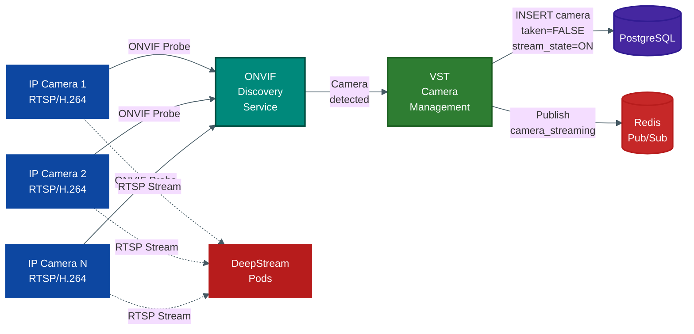

---

## 3. Backend — Layer 1: Control Plane

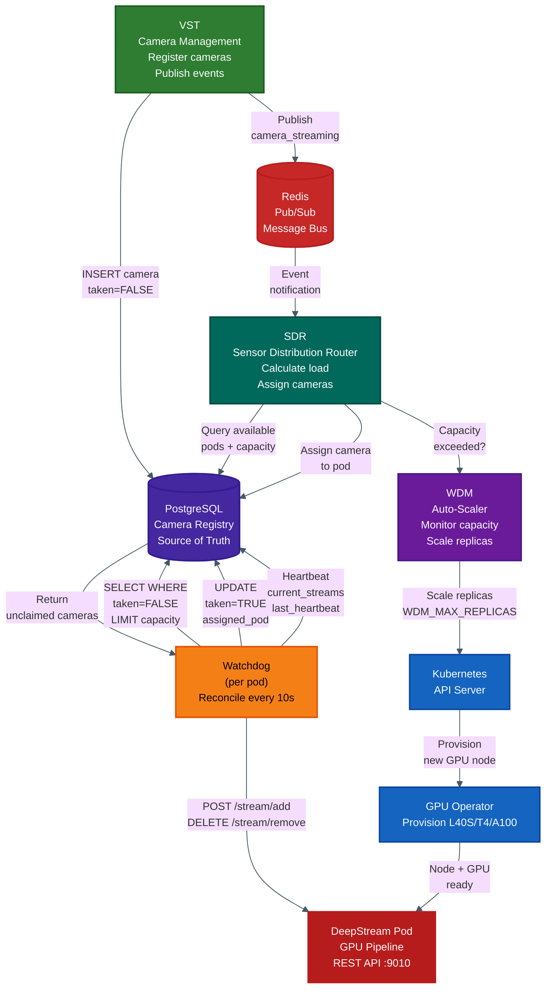

### Component Specifications

| Component | Trigger | Action | Output |
|-----------|---------|--------|--------|
| **VST** | ONVIF probe | Write DB + publish Redis | Camera registered (`taken=FALSE`) |
| **SDR** | Redis `camera_streaming` | Calculate pods, assign cameras | Assignment decision |
| **WDM** | Capacity exceeded | K8s scale-up | New GPU pod provisioned |
| **Watchdog** | Timer (10s) | Remove stale / add new / heartbeat | Pipeline updated via REST |

---

## 4. Backend — Layer 2: Data Plane (DeepStream Pipeline)

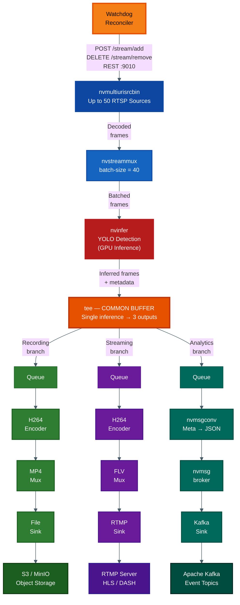

### Pipeline Element Reference

| Element | Plugin | Purpose | Config |
|---------|--------|---------|--------|
| **Source** | `nvmultiurisrcbin` | Ingest RTSP streams | Up to 50 sources/pod |
| **Muxer** | `nvstreammux` | Batch frames for GPU | `batch-size=40` |
| **Inference** | `nvinfer` | YOLO detection | Object detection + classification |
| **Splitter** | `tee` | Common buffer split | 3 branches |
| **Recording** | `h264enc` → `mp4mux` → `filesink` | Store video | → S3/MinIO |
| **Streaming** | `h264enc` → `flvmux` → `rtmpsink` | Live delivery | → RTMP Server |
| **Analytics** | `nvmsgconv` → `nvmsgbroker` → Kafka | Event publish | → Kafka topic |

---

## 5. Backend — Layer 3: Output

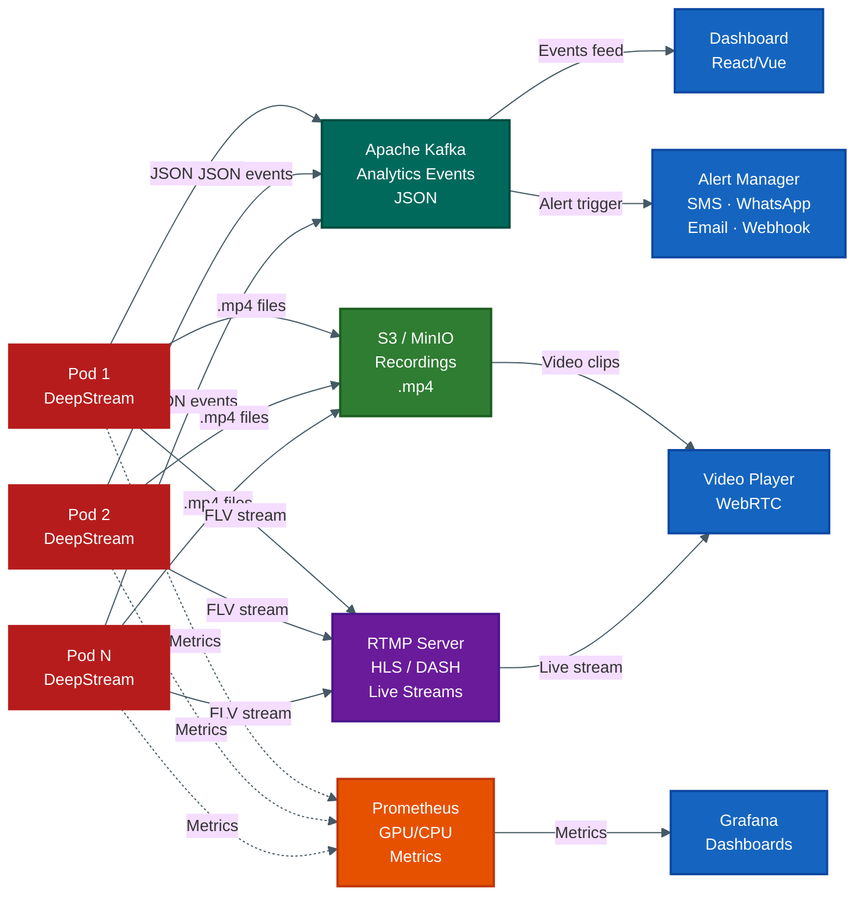

---

## 6. Auto-Scaling Flow

> Scaling from 100 → 200 cameras automatically

```mermaid
%%{init: {'theme': 'base', 'themeVariables': { 'fontSize': '14px', 'lineColor': '#455A64' }}}%%
flowchart TD
    T0["T0: STEADY STATE\n100 cameras · 2 GPUs\nPod 1: 50 cams (100%)\nPod 2: 50 cams (100%)"]:::steady

    T0 -->|"100 new cameras\ndetected via ONVIF"| T1["T1: CAMERAS DETECTED\nVST writes to DB (taken=FALSE)\nSDR receives Redis event\nSDR calculates: need 4 pods\nCurrently 2 → need +2"]:::detect

    T1 -->|"Capacity exceeded"| T2["T2: SCALE TRIGGERED\nWDM: current=100, desired=200\nWDM_MAX_REPLICAS = 3 (min)\nK8s scales to 4 replicas\nGPU Operator provisions nodes"]:::scale

    T2 -->|"GPU nodes provisioned"| T3["T3: NEW PODS START\nPod 3 (GPU 2, 0 cams)\nPod 4 (GPU 3, 0 cams)\nWatchdog services begin"]:::newpods

    T3 -->|"Watchdog runs\nevery 10s"| T4["T4: RECONCILIATION\nPod 3: SELECT taken=FALSE LIMIT 50\nPod 4: SELECT taken=FALSE LIMIT 50\nPOST /stream/add for each\nUPDATE taken=TRUE"]:::reconcile

    T4 -->|"All cameras\nassigned"| T5["T5: BALANCED STATE\nPod 1: 50 cams (100%)\nPod 2: 50 cams (100%)\nPod 3: 50 cams (100%) ← new\nPod 4: 50 cams (100%) ← new\nTotal: 200/200"]:::balanced

    T5 -->|"Continuous"| T6["T6: MAINTENANCE\nWatchdog continues per pod\nPhase 1: Remove stale\nPhase 2: Claim new\nPhase 3: Heartbeat"]:::maintain

    classDef steady fill:#1565C0,stroke:#0D47A1,color:#fff,stroke-width:2px
    classDef detect fill:#F57F17,stroke:#E65100,color:#000,stroke-width:2px
    classDef scale fill:#C62828,stroke:#B71C1C,color:#fff,stroke-width:2px
    classDef newpods fill:#6A1B9A,stroke:#4A148C,color:#fff,stroke-width:2px
    classDef reconcile fill:#E65100,stroke:#BF360C,color:#fff,stroke-width:2px
    classDef balanced fill:#2E7D32,stroke:#1B5E20,color:#fff,stroke-width:3px
    classDef maintain fill:#00695C,stroke:#004D40,color:#fff,stroke-width:2px
```

---

## 7. Watchdog Reconciliation Loop

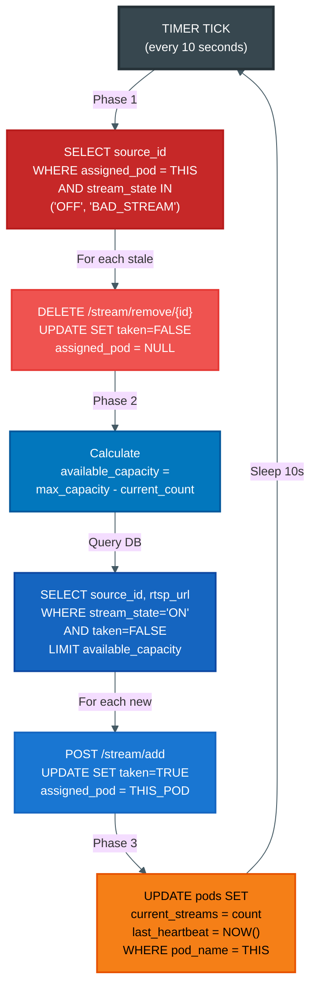

---

## 8. End-to-End Data Flow

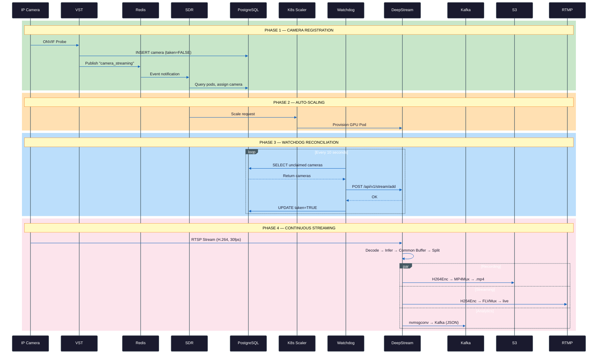

---

## 9. Screen-to-Table Reference

| Screen | Primary Table | Related Tables |
|--------|---------------|----------------|
| 1-2: Organization List/Details | `organizations` | `sites`, `users`, `cameras`, `alert_rules` |
| 3-4: Site List/Details | `sites` | `organizations`, `cameras`, `events` |
| 5-6: Camera List/Details | `cameras` | `sites`, `annotations`, `events`, `camera_health` |
| 7: Live View + Annotations | `cameras` | `annotations` |
| 8: Analytics Config | `cameras` | `annotations` |
| 9-10: Events Explorer/Details | `events` | `organizations`, `sites`, `cameras`, `users` |
| 11-12: Alert Rules/Wizard | `alert_rules` | `organizations`, `sites`, `cameras` |
| 13-14: User List/Details | `users` | `organizations` |
| 15: Dashboard | (aggregated) | `organizations`, `sites`, `cameras`, `events`, `pods` |
| 16: Audit Logs | `audit_logs` | `users`, `organizations` |
| 17: System Settings | `system_config` | — |
| 18: Notification History | `notification_queue` | `events`, `alert_rules` |

## Component Interaction Summary

| Component | Trigger | Action | Output |
|-----------|---------|--------|--------|
| **VST** | ONVIF probe | Write DB + Redis event | Camera registered |
| **SDR** | Redis event | Calculate + assign | Assignment decision |
| **K8s/WDM** | Capacity exceeded | Provision GPU node | New pod |
| **Watchdog** | Timer (10s) | Add/remove via REST | Pipeline updated |
| **DeepStream** | REST API call | Modify running pipeline | Stream added/removed |
| **Pipeline** | Frame arrival | Detect → Split → Output | Recording + Streaming + Analytics |

## Key Design Principles

| Principle | How It Works |
|-----------|-------------|
| **Common Buffer** | Single GPU inference feeds 3 outputs via `tee` — no redundant processing |
| **Decentralized Reconciliation** | Each pod runs its own watchdog independently |
| **Database as Source of Truth** | `taken` flag prevents double-assignment across pods |
| **K8s GPU Orchestration** | GPU Operator + WDM_MAX_REPLICAS scales hardware |
| **Event + Polling Hybrid** | Redis for immediate events, watchdog for reconciliation |
| **Location Awareness** | Cameras assigned to geographically closest pods |
| **Self-Healing** | Components fail independently; system auto-recovers |
