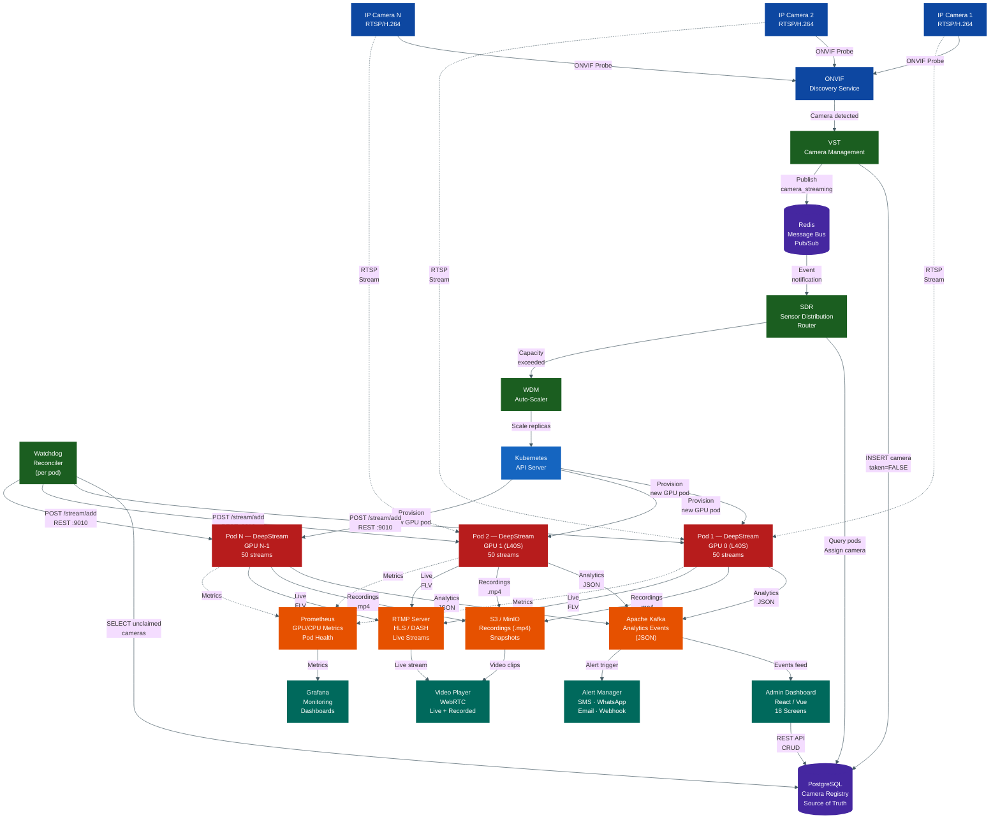
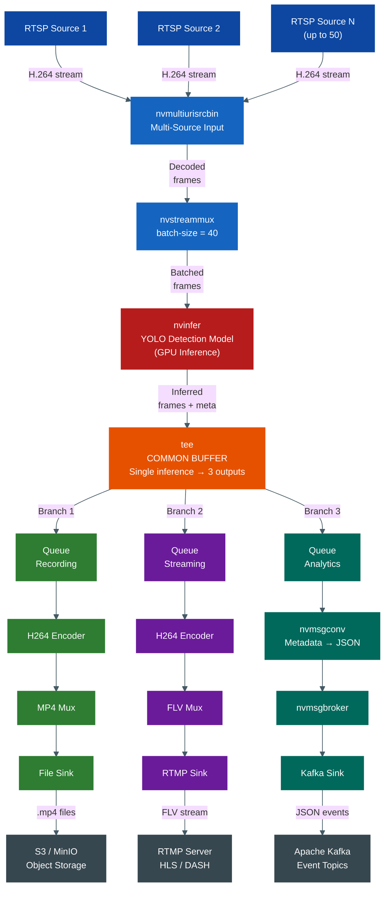
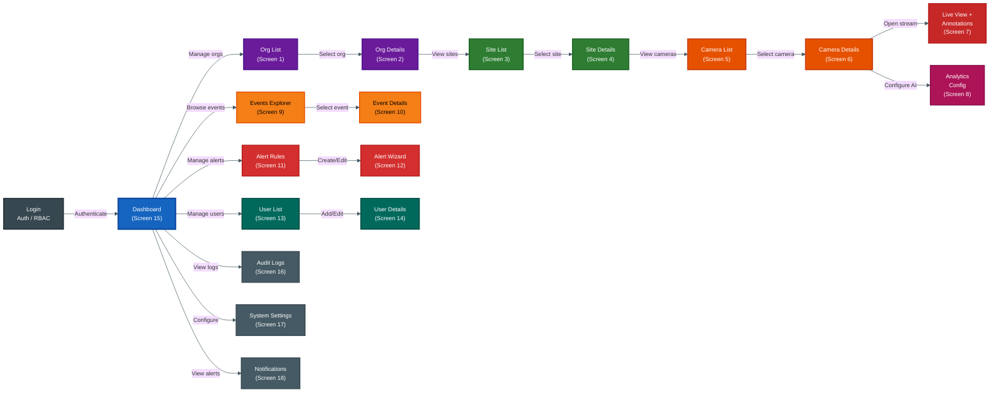
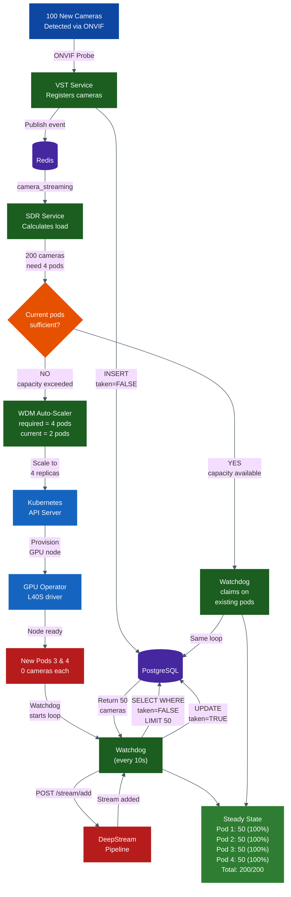
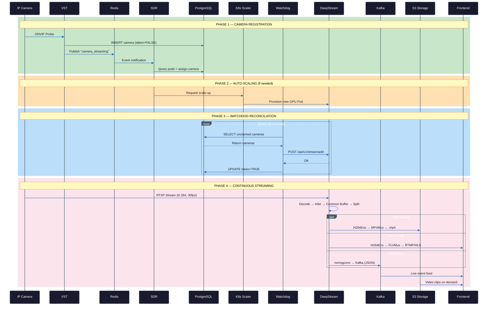

# Video Analytics Platform — High-Level Architecture

> Multi-Tenant | GPU-Accelerated | Kubernetes-Orchestrated

---

## 1. System Architecture — Block Diagram

---

## 2. DeepStream Pipeline — Common Buffer Block Diagram

---

## 3. Frontend Screen Flow — Connected Navigation

---

## 4. Auto-Scaling Flow — Connected Block Diagram

---

## 5. End-to-End Data Flow

---

## 6. Layer Summary

| Layer | Components | Input | Output |
|-------|------------|-------|--------|
| **Layer 0 — Ingestion** | IP Cameras, ONVIF Discovery | Camera network | RTSP streams, camera registration |
| **Layer 1 — Control Plane** | VST, SDR, Watchdog, WDM | Registered cameras | Stream assignments, pod scaling |
| **Layer 2 — Data Plane** | DeepStream Pods (GPU) | RTSP streams | Recordings, live streams, events |
| **Layer 3 — Output** | Kafka, S3, RTMP, Prometheus | Pipeline outputs | Consumer-ready data |
| **Frontend** | 18 Admin Screens | REST API / WebSocket | User interface |

## 7. Key Design Principles

| Principle | How It Works |
|-----------|-------------|
| **Common Buffer** | Single GPU inference pass splits into 3 outputs via `tee` — no redundant processing |
| **Decentralized Reconciliation** | Each pod runs its own watchdog to independently claim cameras |
| **Database as Source of Truth** | `taken` flag in PostgreSQL prevents double-assignment across pods |
| **K8s GPU Orchestration** | GPU Operator + WDM_MAX_REPLICAS handles hardware scaling |
| **Event + Polling Hybrid** | Redis for immediate events, watchdog for periodic reconciliation |
| **Location Awareness** | Cameras assigned to geographically closest pods |
| **Self-Healing** | Components fail independently; system self-recovers via watchdog loop |

## 8. Scaling Parameters

| Parameter | Value | Purpose |
|-----------|-------|---------|
| L40S Capacity | 50 streams/GPU | Max RTSP streams per L40S pod |
| T4 Capacity | 20 streams/GPU | Max RTSP streams per T4 pod |
| A100 Capacity | 80 streams/GPU | Max RTSP streams per A100 pod |
| Watchdog Interval | 10 seconds | Reconciliation loop frequency |
| Batch Size | 40 | DeepStream muxer batch size |
| WDM_MAX_REPLICAS | total_gpus - 1 | Maximum pod replicas |
